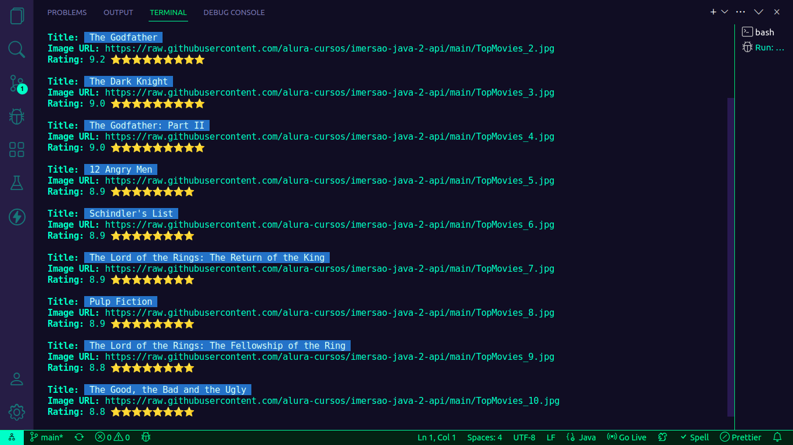

# Imersão Java - Alura [W.I.P.]

Este projeto foi desenvolvido durante a Imersão Java da Alura e também é meu primeiro contato com Java!

Ainda precisa de aperfeiçoamentos, então sinta-se a vontade para contribuir com ideais e soluções!

## Consumindo API com Java

No início, tentei usar a API do IMDb, mas não funcionou. Então, consumi de uma fonte alternativa.

### Mostrando os dados no terminal:

Aprendi a estilizar o texto que aparece no terminal! ^-^

## Gerador de Stickers

Eis um exemplo de sticker gerado:

Ainda estou com dificuldade para corrigir o outline do texto...
